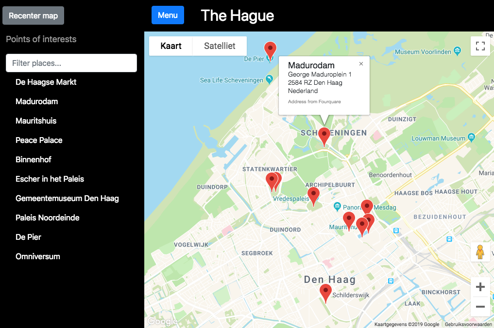

# Udacity Neighborhood Map
This is the repository for the project of Udacity Neighborhood Map. This is done as part of the Udacity Front-End Developer Nanodegree Program. The goal of the project is to create a single-page application of a neighborhood. Extra functionality like maps and highlighted locations should also be part of the page. 

## Description

The goal of this neighborhood app is to showcase the usage of the Knockout Framework, Google Maps API and Foursquare API to create a single-page application. This neighborhood application is optimized for usability on phone, tablet and desktop browsers. Ten points of interests are shown on the map as markers. The sidebar which can be opened by the Menu button, contains a filter function to filter through the 10 POIs in real time. Only the filtered markers will be shown on the map. 

## Live website
To test the site out, please visit the following link: [The Hague Neighborhood Map](https://duncanlew.github.io/udacity_neighborhood_map/)

## Getting started

## Used Resources
The following resources were used for the creation of this application
* Google Maps API 
* Foursquare API
* Bootstrap
